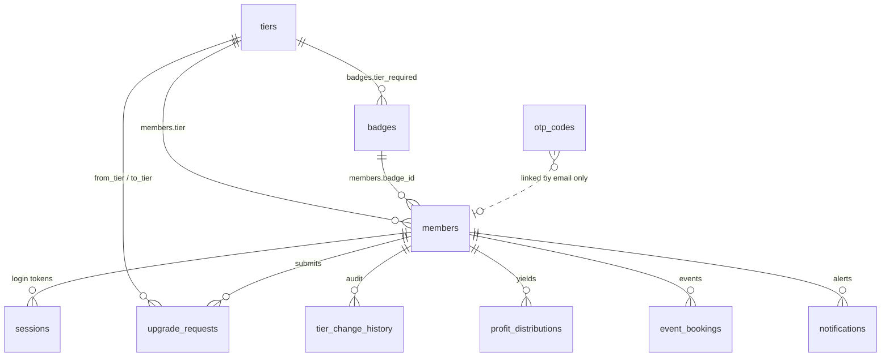

# Database Domains — Architecture Reference

**Last updated:** 2026-06-29  
**Laravel reference studied:** `routes/user.php`, `routes/admin.php`, `NotificationController`, `AppSettingsController`, `UserSubscriptionController`  
**Related:** [UPGRADE_REQUESTS.md](../../UPGRADE_REQUESTS.md)

---

## Purpose

This document groups every Supabase table by **business domain** so a new developer (or non-technical stakeholder) can understand the system in a few minutes.

Domains follow the same philosophy as the Laravel reference project (grandbank): group by **who uses the feature** and **what job it does** — not by technical details like UUID vs text columns.

---

## The hub: `members`

Every domain connects back to one member row. Think of `members` as the person; everything else describes their login, tier, perks, messages, or HQ rules that affect them.

```
MEMBER (hub: members)
│
├── Identity          — Who are you? Can you log in?
├── Membership        — What tier are you? How did you get there?
├── Benefits          — What perks does your tier unlock?
├── Engagement        — How does the system communicate with you?
└── Platform          — How does HQ configure the app?
```

---

## Domain 1 — Identity

**Plain question:** *Who are you, and can you access the portal?*

| Table | Role | Description |
|---|---|---|
| `members` | **Hub** | Core profile: email, name, tier, role, status |
| `sessions` | Child | Bearer tokens created after OTP login (7-day expiry) |
| `otp_codes` | Ephemeral | One-time login codes; backend-only (no RLS for clients) |

### User flow

```
/login → enter email → receive OTP → verify code
  → backend finds members row by email
  → inserts sessions row
  → frontend stores token in localStorage
  → /dashboard
```

### Laravel parallel

- `users` + `sessions` + password/OTP flows
- Auth middleware gates all dashboard routes (`auth:sanctum`, `verified`)

### API routes

| Method | Path | Auth |
|---|---|---|
| POST | `/auth/send-otp` | Public |
| POST | `/auth/verify-otp` | Public |
| GET | `/members/me` | Member |

### Notes

- `members.auth_user_id` optionally links to Supabase Auth JWT; OTP flow works without it.
- Members must pre-exist in DB — no self-registration yet.

---

## Domain 2 — Membership

**Plain question:** *What membership level are you, and how did you move up?*

| Table | Role | Description |
|---|---|---|
| `tiers` | Catalog | Explorer / Pioneer / Vanguard — price, rank, benefits |
| `upgrade_requests` | Workflow | Member submits; admin reviews; tracks payment ref |
| `tier_change_history` | Audit | Immutable log written when a tier is approved |

### User flow

```
/dashboard or /upgrade → pick tier → /payment → submit request (PENDING)
  → admin PATCH approve
  → members.tier updated
  → tier_change_history row inserted
  → notification sent (Engagement domain)
```

### Laravel parallel

| Laravel | zam-app |
|---|---|
| `plans` (catalog) | `tiers` |
| `user_plans` (active subscription) | `members.tier` |
| `deposits` (payment proof) | `upgrade_requests.payment_reference` (fields exist, not wired in UI) |
| `upgrades` (minimal log) | `upgrade_requests` + `tier_change_history` (richer) |

### API routes

| Method | Path | Auth |
|---|---|---|
| GET | `/tiers` | Public |
| GET/POST/DELETE | `/upgrade-requests/*` | Member |
| PATCH | `/upgrade-requests/:id` | Admin |
| GET | `/tier-change-history` | Member |
| GET/POST/PATCH/DELETE | `/admin/tiers` | Admin |

### Business rules (summary)

- Requested tier must have higher `rank` than current tier.
- Only one PENDING request per target tier per member.
- Approval always sets `reviewed_at` and `reviewed_by`.
- On APPROVE: update `members.tier` + insert `tier_change_history`.

See [UPGRADE_REQUESTS.md](../../UPGRADE_REQUESTS.md) for full detail.

---

## Domain 3 — Benefits

**Plain question:** *What do you get at your membership level?*

| Table | Role | Description |
|---|---|---|
| `badges` | Benefit catalog | Credential definitions gated by `tier_required` |
| `profit_distributions` | Child | Monthly yield records per member |
| `event_bookings` | Child | VIP event attendance per member |

### Catalog vs earned (important)

| Concept | Where it lives |
|---|---|
| Badge **definition** (what exists) | `badges` table |
| Badge **earned** (what this member has) | `members.badge_id` |
| Event **booking** (member action) | `event_bookings` |
| Profit **payout** (system action) | `profit_distributions` |

This mirrors Laravel's split: `plans` (catalog) vs `user_plans` (what the member has).

### User flow (today)

```
/badges → compare member tier rank vs badge.tier_required → show locked/unlocked
/dashboard → locked asset cards → redirect to /upgrade (benefits not fully wired)
```

### Laravel parallel

- ROI / balance on `users` (`account_bal`, `roi`)
- Plan perks embedded in `plans` + active rows in `user_plans`
- No direct badge table in grandbank — zam-app extends this concept

### API routes

| Method | Path | Auth | UI wired? |
|---|---|---|---|
| GET | `/badges` | Public read | Yes (`/badges`) |
| GET | `/profit-distributions` | Member | No |
| GET/POST/PATCH | `/event-bookings` | Member | No |

### Known gaps

- Tier approval does not auto-update `members.badge_id` or `display_level`.
- `badges.allows_event_booking` flag exists but booking UI does not check it yet.

---

## Domain 4 — Engagement

**Plain question:** *How does the system talk to you?*

| Table | Role | Status |
|---|---|---|
| `notifications` | In-app alerts | **Live** |
| emails | Delivery channel (Resend) | Live via `notify.ts`, no table |
| announcements | Broadcast messages | **Future** |
| activity_logs | Audit of member actions | **Future** |

### Sub-domains (Laravel-inspired split)

Keep these **separate** even under the Engagement umbrella:

| Sub-domain | Purpose | Laravel equivalent |
|---|---|---|
| In-app notifications | Member-facing alerts | `notifications` + `NotificationController` |
| Email delivery | Out-of-band messages | `Mail` facade + `settings.contact_email` |
| Activity logs | What happened (audit) | `userlogs`, `activities` |

Do not merge audit logs into the notifications table.

### User flow

```
Upgrade submitted → notifyUpgradeStatus() → notifications row + optional email
/members sees bell count → /notifications → mark read
/admin/notifications → admin sends custom message to a member
```

### API routes

| Method | Path | Auth |
|---|---|---|
| GET/PATCH | `/notifications/*` | Member |
| POST | `/admin/notify` | Admin |

---

## Domain 5 — Platform

**Plain question:** *What global rules does HQ set?*

| Table | Role | Status |
|---|---|---|
| `settings` | Global app config | **Live** — singleton row `id = 1` |
| `tiers` admin CRUD | Tier catalog management | Live via `/admin/tiers` |

### Example settings (future)

| Key | Purpose |
|---|---|
| `site_name` | Branding |
| `support_email` | Admin alert destination |
| `upgrade_enabled` | Disable upgrade flow without deploy |
| `maintenance_mode` | Block portal temporarily |
| `feature_flags` | Gradual feature rollout |

### Laravel parallel

- `settings` singleton row (`id = 1`)
- `Admin/Settings/AppSettingsController` — dedicated admin area
- Read on every deposit, verification, and email send

### Why define this domain now

Laravel grew a single fat `settings` row over time. Naming the Platform domain early prevents configuration scattered across env vars, hardcoded flags, and unrelated tables.

---

## Table reference card

| Domain | Tables |
|---|---|
| **Identity** | `members`, `sessions`, `otp_codes` |
| **Membership** | `tiers`, `upgrade_requests`, `tier_change_history` |
| **Benefits** | `badges`, `profit_distributions`, `event_bookings` |
| **Engagement** | `notifications` (+ future: announcements, activity_logs) |
| **Platform** | `settings`; tier admin via `/admin/tiers` |

---

## Relationship diagram



---

## Three questions per domain (quick onboarding)

| Question | Domain |
|---|---|
| Who are you? | Identity |
| What level are you? | Membership |
| What do you get? | Benefits |
| How do we tell you? | Engagement |
| What rules does HQ set? | Platform |

---

## Code organization (recommended, not yet enforced)

When refactoring routes or Drizzle schemas, mirror these domains:

```
backend/src/routes/
  otp.ts                    → Identity
  members.ts, sessions.ts   → Identity
  tiers.ts                  → Membership
  upgrade-requests.ts       → Membership
  tier-change-history.ts    → Membership
  badges.ts                 → Benefits
  profit-distributions.ts   → Benefits
  event-bookings.ts         → Benefits
  notifications.ts          → Engagement
  admin.ts                  → Platform + cross-domain admin

lib/db/src/schema/
  (same grouping when reorganized)
```

---

## zam-app vs grandbank — domain comparison

| Domain | grandbank (Laravel) | zam-app | Maturity |
|---|---|---|---|
| Identity | users, sessions, kyc | members, sessions, otp_codes | Solid |
| Membership | plans, user_plans, upgrades, deposits | tiers, upgrade_requests, tier_change_history | Strong |
| Benefits | balances, subscriptions, assets | badges, profit_distributions, event_bookings | DB yes, UI partial |
| Engagement | notifications, activities, userlogs | notifications | MVP |
| Platform | settings, appearance_settings | settings + admin tiers API | Live (API; admin UI TBD) |

---

## Related files

| Area | Path |
|---|---|
| Supabase migrations | `supabase/migrations/` |
| Drizzle schemas | `lib/db/src/schema/` |
| Seed data | `supabase/seed/seed.sql` |
| Upgrade feature doc | [UPGRADE_REQUESTS.md](../../UPGRADE_REQUESTS.md) |
| Backend entry | `backend/src/index.ts` |
| Frontend routes | `frontend/src/App.tsx` |
